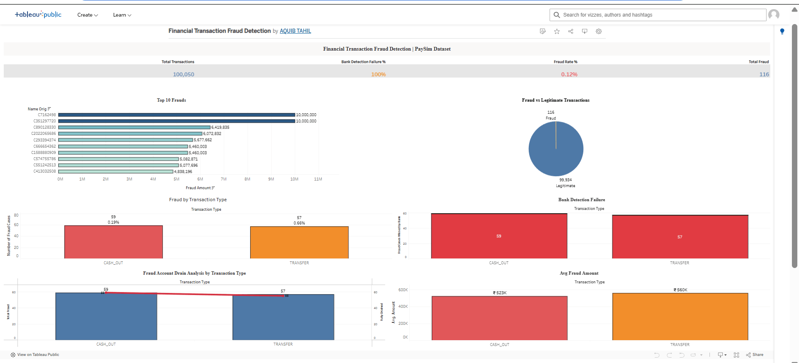

💳 Financial Transaction Fraud Analysis
📌 Overview

Analyzed 100,050 financial transactions using SQL & Tableau to identify fraud patterns, detection gaps, and high-risk behaviors in BFSI.

🎯 Key Insights
🔴 Fraud Rate: 0.12%
⚠️ 100% fraud in TRANSFER & CASH_OUT
💰 Max Fraud: ₹1 Crore
🚨 Detection System: 100% miss rate
🔍 96–100% cases led to full account drain

🛠 Tools
MySQL (data analysis)
Tableau (dashboard & story)
Excel (data cleaning)

📊 Dashboard Highlights
KPI Summary (Fraud Rate, Total Fraud, Detection Failure)
Fraud by Transaction Type
Account Drain Pattern Analysis
Fraud Trend & Top Transactions

📁 Files
Tableau Dashboard (.twbx)
Dataset (.csv)
SQL Queries (.sql)
Screenshots (/images)

💼 Business Impact

Helps detect high-risk transactions, identify fraud patterns, and reduce financial losses.

## 🔗 Live Dashboard
[▶ View on Tableau Public](https://public.tableau.com/app/profile/aquib.tahil/viz/FinancialTransactionFraudDetection/FinancialTransactionFraudDetection?publish=yes)

## 📸 Dashboard Preview

## 👤 Author
**Aquib Tahil
